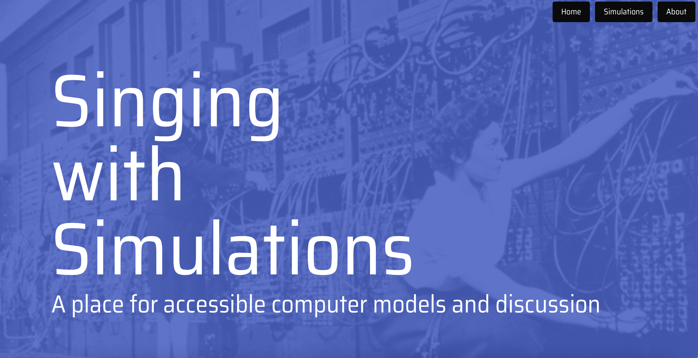

# Django Simulation Space

Computer simulation models have clearly been very important for expanding the boundaries of scientific knowledge. But often, simulation code can only be run with extremely expensive software, or can only be used by researchers with specialized training. The purpose of this project is to address this problem, in a very small way, by creating some simulation models that can be easily used by any person who has a web browser and internet connection.

Although still very much a work in progress, my hope is that this website will become a resource for people interested in different types of computer models. When it is finished, users will be able to run various types of simulations, and will also be able to leave comments to discuss the different models.

The name of the page, "Singing with Simulations", is a reference to something Wynne Godley and Marc Lavoie wrote in their book Monetary Economics. I think the phrase they used—"making it all sing with simulations"—captures both the joy and the inherent strangeness of representing real-life phenomena with computer code. Your mileage may vary, but I hope that when this site is finished, some of that joy will come across for users. 

This is a full-stack web application created with Python/Django. The simulations, as well as user comments, are stored in a MySQL database. The application was deployed using Heroku. 

A link to the deployed application can be found here: https://singwithsims.herokuapp.com

The GitHub repo can be found here: https://github.com/SThompsonChicago/simhub